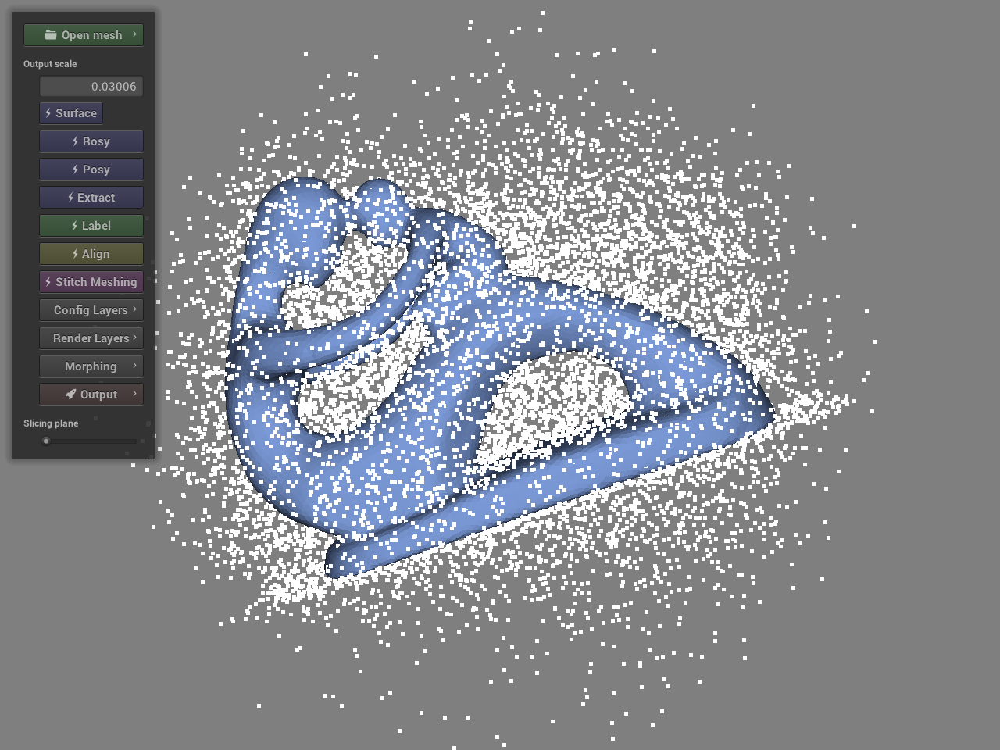
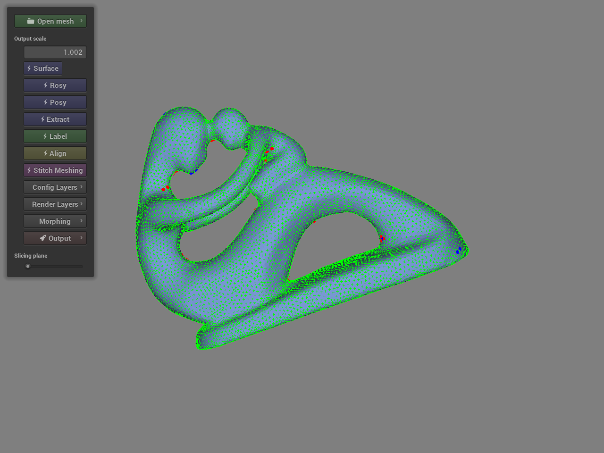
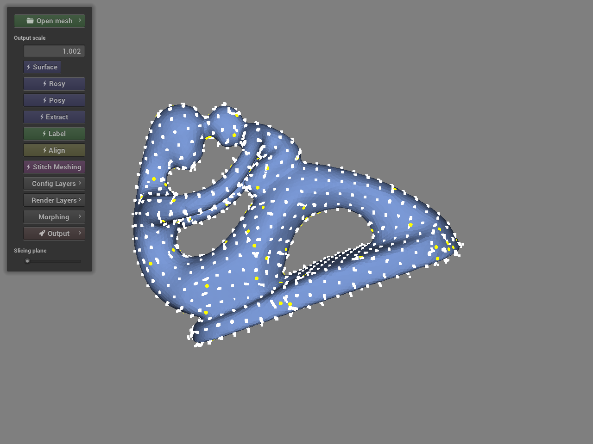
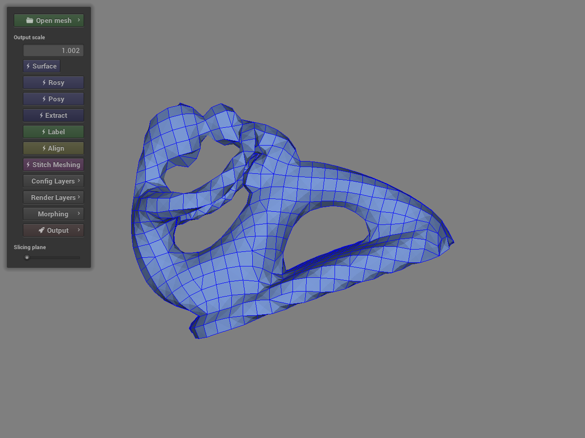
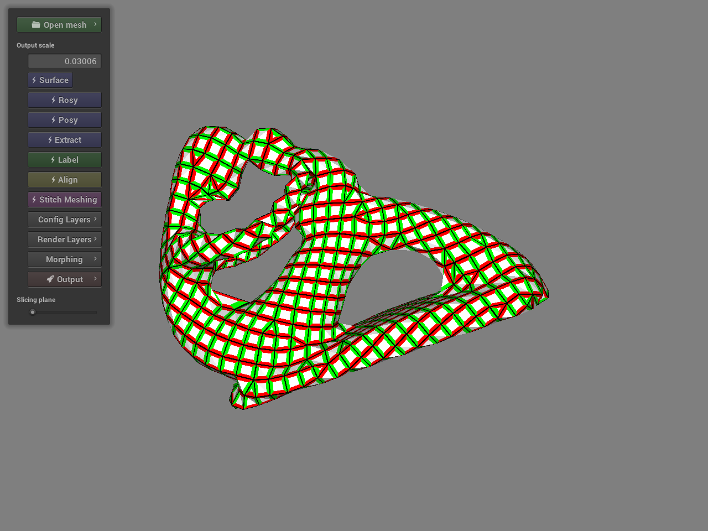
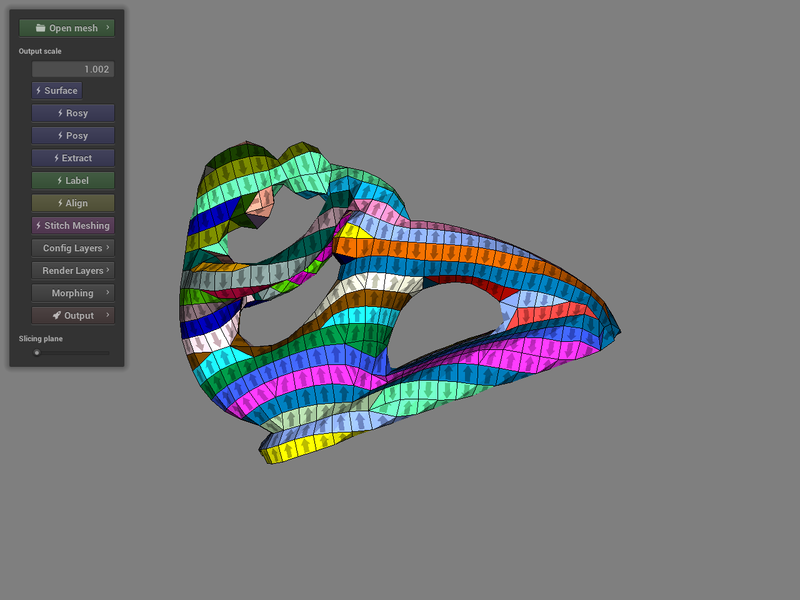
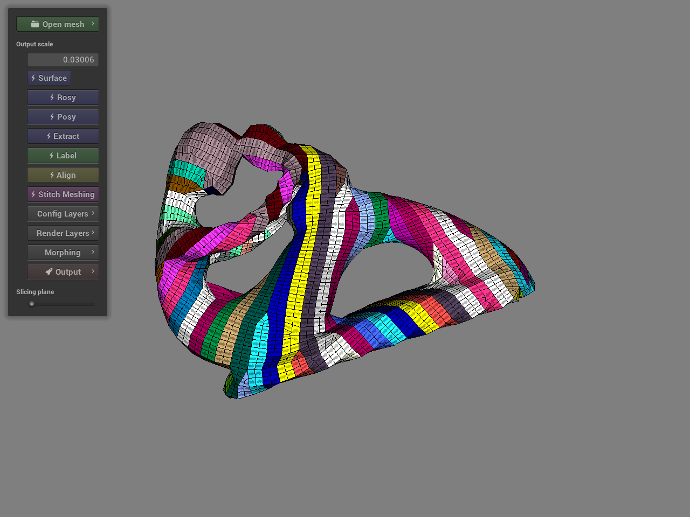

# Stitch Meshing

[Kui Wu](http://www.cs.utah.edu/~kwu/), 
[Xifeng Gao](https://gaoxifeng.github.io/), 
[Zachary Ferguson](http://zfergus.me/), 
[Daniele Panozzo](https://cs.nyu.edu/~panozzo), 
[Cem Yuksel](http://www.cemyuksel.com/)

*ACM Transactions on Graphics (Proceedings of SIGGRAPH 2018), 37, 4, 2018*

## Abstract

We introduce the first fully automatic pipeline to convert arbitrary 3D shapes into knit models. Our pipeline is based on a global parametrization remeshing pipeline to produce an isotropic quad-dominant mesh aligned with a 2-RoSy field. The knitting directions over the surface are determined using a set of custom topological operations and a two-step global optimization that minimizes the number of irregularities. The resulting mesh is converted into a valid stitch mesh that represents the knit model. The yarn curves are generated from the stitch mesh and the final yarn geometry is computed using a yarn-level relaxation process. Thus, we produce topologically valid models that can be used with a yarn-level simulation. We validate our algorithm by automatically generating knit models from complex 3D shapes and processing over a hundred models with various shapes without any user input or parameter tuning. We also demonstrate applications of our approach for custom knit model generation using fabrication via 3D printing.

 ## Project Website
 
 http://www.cs.utah.edu/~kwu/stitchmodeling#stitchmeshing

## Installation
- Clone the repository into your local machine:

- Compile the code using CmakeGUI 

You need to install [Gurobi](http://www.gurobi.com/) before compiling the code.

- Set include directory and lib directory accordingly for gurobi in CMakeLists.txt line 110 and 114.

- Use CmakeGUI with the correct directory for source code and build.

Note that the CMakeLists.txt is only tested with Visual Studio 2015.

## Usage

1. Open stitch-meshing.exe in build/release
2. **Open mesh** and choose your model
3. Surface

4. Rosy

5. Posy

6. Extract 

7. Label

8. Align

9. Stitch Meshing

10. Output

The remeshing and stitch meshing results will be saved in the same folder as the input model is.

## External Libraries 
- [NanoGUI](https://github.com/wjakob/nanogui)
- [PCG32](http://www.pcg-random.org/)
- [Intel(R) Threading Building Blocks](https://www.threadingbuildingblocks.org/)
- [Gurobi](http://www.gurobi.com/)
- [Half Edge Library*](http://halfedgelib.sourceforge.net)
- [RPly library](http://www.impa.br/~diego/software/rply)

\* are included libraries
